# Solo Mode - AI Snake System

Complete documentation for the Snake Battle Solo Mode, explaining how AI bots work at each difficulty level.

---

## Overview

Solo Mode allows players to practice against AI-controlled snake bots. Players can choose:
- **Difficulty**: Easy, Medium, or Hard
- **Number of Bots**: 1 to 3 bots

The AI system runs on the backend, with bots making movement decisions every game tick (100ms at normal speed).

---

## How AI Bots Work

### Bot Spawning

When a solo game is created:
1. Frontend calls `POST /api/v1/games/snake/solo` with difficulty and bot count
2. Backend creates a private room
3. Bots are spawned with the `SpawnBot` message
4. Each bot gets a unique ID, name (e.g., "Medium Bot"), random color, and starting position
5. Bots are auto-marked as ready

```rust
// Bot spawning logic
fn spawn_bot(&mut self, difficulty: BotDifficulty) {
    let bot_id = Uuid::new_v4().to_string();
    let bot_name = format!("{:?} Bot", difficulty); // "Easy Bot", "Medium Bot", etc.
    
    // Create player with is_bot = true
    let player = Player {
        id: bot_id.clone(),
        name: bot_name,
        is_bot: true,
        difficulty: Some(difficulty),
        ready: true,  // Bots are always ready
        ...
    };
}
```

---

## AI Decision Making

Every game tick, the game loop checks all bot players and calls their AI decision function:

```rust
// In the game tick function
for bot_id in bot_ids {
    if let Some(new_direction) = self.state.bot_decide_direction(&bot_id) {
        player.snake.set_direction(new_direction);
    }
}
```

### Decision Flow


---

## Difficulty Levels

### 🟢 Easy Mode

**Behavior**: Random movement with occasional food seeking

| Aspect | Value |
|--------|-------|
| Random moves | 70% |
| Food seeking | 30% |
| Wall awareness | ❌ None |
| Collision avoidance | ❌ None |

**Algorithm**:
```rust
fn bot_easy_decision(head, current_direction) -> Direction {
    if random() < 0.3 && food_exists {
        // 30% chance: move toward nearest food
        return direction_toward(head, food_position);
    }
    
    // 70% chance: pick random valid direction
    let options = valid_turns(current_direction);
    return random_choice(options);
}
```

**Best for**: Beginners learning the controls

---

### 🟡 Medium Mode

**Behavior**: Active food seeking with wall avoidance

| Aspect | Value |
|--------|-------|
| Food seeking | 100% |
| Wall avoidance | ✅ Yes |
| Snake avoidance | ❌ Basic |
| Pathfinding | Direct |

**Algorithm**:
```rust
fn bot_medium_decision(head, current_direction) -> Direction {
    let desired = direction_toward(head, food);
    
    // Check if desired direction is safe
    if is_direction_safe(head, desired) {
        return desired;
    }
    
    // Try alternative safe directions
    for dir in valid_turns(current_direction) {
        if is_direction_safe(head, dir) {
            return dir;
        }
    }
    
    return current_direction;
}
```

**Safety Check**:
- ✅ Won't move into walls
- ✅ Won't move into snake bodies
- ❌ Doesn't predict future collisions

**Best for**: Casual players

---

### 🔴 Hard Mode

**Behavior**: Advanced pathfinding with strategic evaluation

| Aspect | Value |
|--------|-------|
| Food seeking | ✅ Optimized |
| Wall avoidance | ✅ Yes |
| Snake avoidance | ✅ Advanced |
| Space evaluation | ✅ Flood-fill |
| Power-up seeking | ✅ Yes |

**Algorithm Overview**:

The Hard AI evaluates ALL possible directions and assigns a score to each:

```rust
fn bot_hard_decision(player_id, head, current_direction) -> Direction {
    let mut best_direction = current_direction;
    let mut best_score = -1000.0;
    
    for direction in valid_turns(current_direction) {
        let score = evaluate_direction(player_id, head, direction, food);
        if score > best_score {
            best_score = score;
            best_direction = direction;
        }
    }
    
    return best_direction;
}
```

**Scoring System**:

| Factor | Points | Description |
|--------|--------|-------------|
| Wall collision | -1000 | Immediate death |
| Snake collision | -1000 | Immediate death |
| Distance to food | -distance | Closer = better |
| Open space | +0.1 × spaces | More room = safer |
| Near power-up | +2.0 | Within 5 tiles |

**Space Evaluation (Flood Fill)**:

The Hard AI uses a flood-fill algorithm to count reachable spaces:

```rust
fn count_reachable_spaces(start_position) -> usize {
    // BFS to count how many cells can be reached
    // Limited to 10 depth for performance
    
    let mut visited = HashSet::new();
    let mut queue = [start_position];
    let mut count = 0;
    
    while !queue.empty() && count < 10 {
        let pos = queue.pop();
        for each direction {
            let next = move_in_direction(pos, direction);
            if is_valid(next) && !is_blocked(next) {
                visited.insert(next);
                queue.push(next);
            }
        }
        count++;
    }
    
    return count;
}
```

This prevents the snake from entering dead ends!

**Best for**: Experienced players seeking challenge

---

## Helper Functions

### `valid_turns(current: Direction) -> Vec<Direction>`
Returns all directions except the opposite (can't go backwards):
- If moving Up/Down: can turn to Up, Down, Left, Right (except opposite)
- If moving Left/Right: can turn to Left, Right, Up, Down (except opposite)

### `direction_toward(from: Point, to: Point) -> Direction`
Calculates the direction to move from `from` toward `to`:
- Prioritizes axis with larger distance
- If target is more to the right than down, returns Right

### `is_direction_safe(head: Point, dir: Direction) -> bool`
Checks if moving in direction is immediately safe:
1. Won't hit walls
2. Won't hit any snake body

### `next_position(pos: Point, dir: Direction) -> Point`
Returns the position after moving one step in direction.

---

## Game Integration

### Bot Lifecycle

```mermaid
sequenceDiagram
    participant F as Frontend
    participant B as Backend
    participant R as GameRoom
    participant AI as AI System

    F->>B: POST /api/v1/games/snake/solo
    B->>R: Create Room
    B->>R: SpawnBot(difficulty) × N
    R->>R: Create bot players
    F->>R: WebSocket Connect
    F->>R: Join as human
    R->>F: GameState (with bots)
    F->>R: Ready
    
    loop Game Tick (every 100ms)
        R->>AI: bot_decide_direction(bot_id)
        AI->>R: New Direction
        R->>R: Update snake directions
        R->>R: Move all snakes
        R->>F: GameState update
    end
```



### Bot Data in GameState

Bots appear as regular players in the game state, with additional fields:

```typescript
interface Player {
    id: string;
    name: string;
    snake: Snake;
    score: number;
    color: string;
    ready: boolean;
    is_bot: boolean;           // true for AI players
    difficulty?: 'Easy' | 'Medium' | 'Hard';
}
```

---

## Performance Considerations

| Difficulty | CPU Impact | Notes |
|------------|------------|-------|
| Easy | Low | Simple random + direction check |
| Medium | Low | Direction + safety check |
| Hard | Medium | Flood-fill limited to depth 10 |

The flood-fill is capped at 10 iterations to prevent performance issues with many bots.

---

## Future Improvements

- [ ] Aggression setting (hunt other snakes vs avoid)
- [ ] Team-based AI behavior
- [ ] Machine learning trained bots
- [ ] Personality traits (cautious, aggressive, food-focused)
